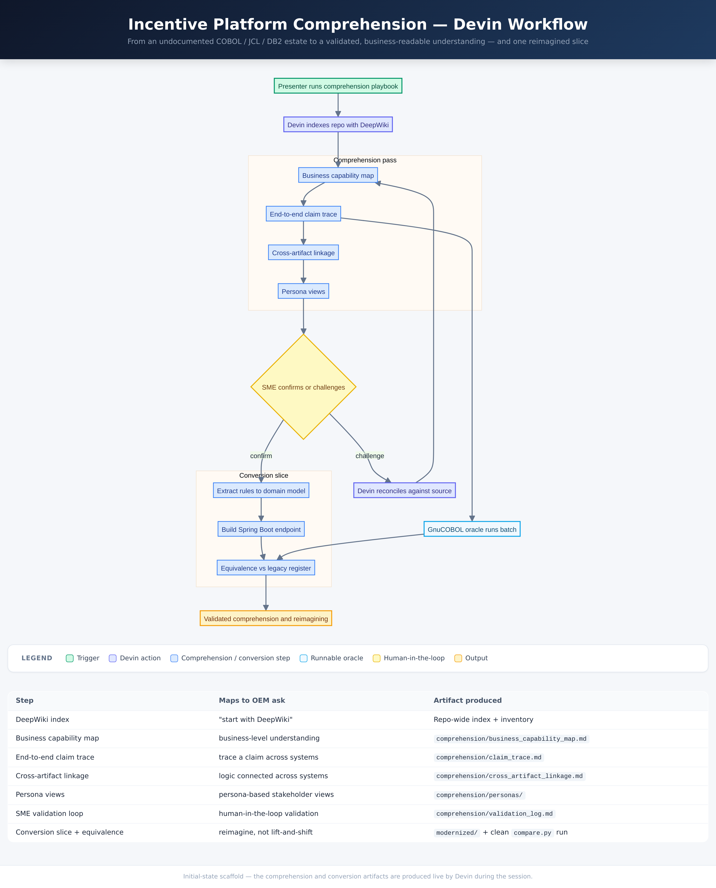

# Incentive Platform Comprehension Demo

A poorly-documented dealer-incentive **claims platform** for a large vehicle manufacturer ("the OEM"),
recreated as an authentic mainframe estate — COBOL batch, JCL, DB2 SQL PL stored procedures, and a
half-migrated Struts → Spring MVC front end — that **Devin comprehends and begins to reimagine live**.



> Full diagram: [`docs/flowchart.html`](docs/flowchart.html)

## What this demo shows

The OEM has no living SME who understands the incentive platform end to end, and they want to
*reimagine* it — not lift-and-shift it. Before that, they need **comprehension first**. This repo is
the *before* state: a runnable legacy estate with no real documentation. In a live session Devin
indexes it, produces a business-readable understanding (capability map, end-to-end claim trace,
cross-artifact linkage, persona views), validates it with a subject-matter expert, and then converts
one vertical slice into a modern service — proving behavioural parity against the running COBOL.

## What Devin does live

Nothing under `comprehension/` or `modernized/` is pre-written — Devin produces it during the demo,
driven by the two skills in `.agents/skills/`. Devin indexes the estate with **DeepWiki**, reads
the actual `PROCEDURE DIVISION` logic (not header comments) to build a top-down **business-capability
map**, traces a single claim across COBOL/JCL/DB2, documents **duplicated rules that have drifted**
across code and database, writes **persona views** for dealer-operations / compliance / finance, runs
an **SME validation loop** (presenter confirms or challenges each finding), and finally reimagines the
**eligibility + pricing** slice as a Spring Boot service whose output is checked field-for-field
against the legacy batch.

## How the demo runs

1. The presenter invokes the [`comprehend-incentive-platform`](.agents/skills/comprehend-incentive-platform/SKILL.md) skill
   ("start with DeepWiki"). Devin works through Phases 0–5 and fills `comprehension/`.
2. The presenter (as SME) challenges findings; Devin reconciles them against the source and the
   running harness.
3. The presenter invokes the [`convert-claim-path`](.agents/skills/convert-claim-path/SKILL.md) skill.
   Devin reimagines one slice into `modernized/` and proves equivalence.

The legacy batch is genuinely runnable — it is the validation **oracle**:

```bash
./harness/build.sh        # compile INCMAIN + 7 subprograms with GnuCOBOL (cobc)
./harness/run_legacy.sh   # run the batch over testdata/input/, write build/out/payout.dat
python3 harness/compare.py testdata/expected/payout.dat build/out/payout.dat
# -> EQUIVALENT: 17 claims match across all 9 fields
```

`testdata/expected/payout.dat` is the golden payout register captured from that COBOL run; the modern
slice must reproduce it. CI ([`.github/workflows/ci.yml`](.github/workflows/ci.yml)) builds, runs, and
diffs it on every push so the oracle stays reproducible.

## Repo layout

```
docs/            flowchart (html+png), data-dictionary.md, IMPLEMENTATION_PLAN.md
legacy/          the "before" estate Devin comprehends
  cobol/         INCMAIN driver + INCEDIT INCEXC INCVAL INCELIG INCCALC INCPAY INCREV
  copybook/      shared record layouts + constants (CLAIMREC, PAYOUTREC, INCCONST, ERRCODES, ...)
  jcl/  proc/    INCDAILY (nightly), INCGLFD (GL feed) + cataloged INCPROC
  db2/           DDL + SP_ELIGIBILITY / SP_RATE_LOOKUP (SQL PL) + DCLGEN copybook
  control/       INCPARM control card (runtime caps/flags)
  scheduler/     SCHEDULE.txt (batch-flow dependencies)
  frontend-struts/   Struts 1.x action + form + JSP (current front end)
  frontend-spring/   ClaimController.java (Struts -> Spring MVC migration, partial)
testdata/        input/ fixtures (17 claims, 5 dealers, 6 programs) + expected/ golden register
harness/         build.sh, run_legacy.sh, make_fixtures.py, compare.py (the GnuCOBOL oracle)
comprehension/   EMPTY at start — Devin fills live (capability map, claim trace, linkage, personas)
modernized/      EMPTY at start — Devin fills live (Spring Boot slice + equivalence)
.agents/skills/   comprehend-incentive-platform/, convert-claim-path/ (skills Devin runs live)
```

## Key concepts

| Term | Meaning |
|------|---------|
| Claim | A dealer's request for an incentive payout on a vehicle sale; the unit that flows through the batch. |
| Eligibility window | Date range during which a program pays; encoded in `INCELIG` **and** `SP_ELIGIBILITY` (drift risk). |
| Loyalty rule | Prior-ownership bonus enforced in batch (`INCELIG`) but **missing** from the online `SP_ELIGIBILITY` — a real online/batch control gap. |
| Reason code | 2–4 char outcome on each claim (e.g. `OK`, `DLRE` not enrolled, `PRGW` outside window, `LOYX` no prior, `DUP` duplicate); defined in `ERRCODES.cpy`. |
| Status | Final disposition of a claim: `PAID`, `HOLD`, `REJ`, `RVSD` (a duplicate is held with reason `DUP`). |
| Oracle harness | The compiled COBOL batch run on Linux via GnuCOBOL, used as the source of truth for equivalence testing of any modern rewrite. |
| Reimagining (not lift-and-shift) | Extracting the rules into a typed domain model with a single source of truth, not transliterating copybooks line-for-line. |
