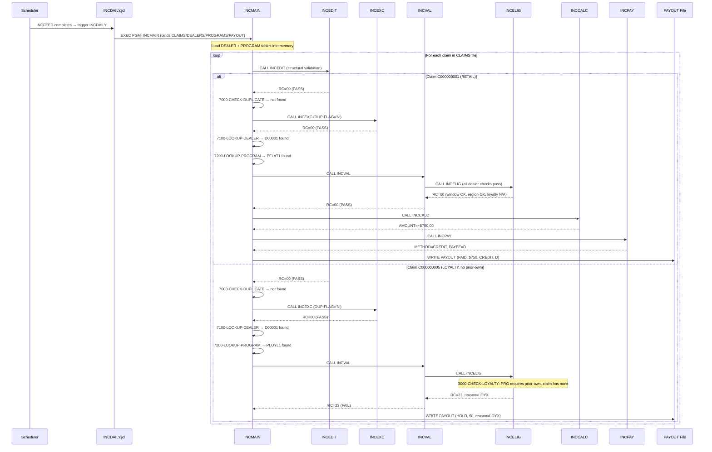

# End-to-End Claim Trace

Two representative claims traced from scheduler trigger through to the payout
register, validated against the running GnuCOBOL harness.

---

## Claim Selection

Using `docs/data-dictionary.md` to decode `testdata/input/claims.dat`:

### PAID claim — C000000001

| Field | Raw bytes | Decoded |
|-------|-----------|---------|
| CLM-CLAIM-ID | `C000000001` | Claim #1 |
| CLM-VIN | `1FORDDEMOA0010000` | Vehicle identifier |
| CLM-DEALER-ID | `D00001` | Riverside Motors |
| CLM-PROGRAM-ID | `PFLAT1` | Q2 Retail Cash Flat ($750) |
| CLM-SALE-DATE | `20250615` | 2025-06-15 |
| CLM-SALE-PRICE | `002850000` | $28,500.00 (implied V99) |
| CLM-CLAIM-TYPE | `RETAIL  ` | Standard retail claim |
| CLM-PRIOR-OWN | `N` | No prior ownership |
| CLM-CUST-BANK | `N` | No bank on file |

### HOLD claim — C000000005

| Field | Raw bytes | Decoded |
|-------|-----------|---------|
| CLM-CLAIM-ID | `C000000005` | Claim #5 |
| CLM-VIN | `1FORDDEMOA0050000` | Vehicle identifier |
| CLM-DEALER-ID | `D00001` | Riverside Motors |
| CLM-PROGRAM-ID | `PLOYL1` | Loyalty Conquest PCT (2%) |
| CLM-SALE-DATE | `20250701` | 2025-07-01 |
| CLM-SALE-PRICE | `004000000` | $40,000.00 |
| CLM-CLAIM-TYPE | `LOYALTY ` | Loyalty claim |
| CLM-PRIOR-OWN | `N` | No prior ownership |
| CLM-CUST-BANK | `N` | No bank on file |

---

## Trace 1 — PAID Claim C000000001

### Scheduler / JCL entry point

1. **Scheduler** (`SCHEDULE.txt`): Job `INCFEED` fires when file
   `OEM.INCENT.INBOUND.CLAIMS` arrives. Upon completion, job `INCDAILY` runs.
2. **JCL** (`INCDAILY.jcl` STEP010): `EXEC PGM=INCMAIN`. DD names bind:
   - `CLAIMS` -> `OEM.INCENT.CLAIMS(+0)` (current-gen GDG)
   - `DEALERS` -> `OEM.INCENT.DEALER.MASTER`
   - `PROGRAMS` -> `OEM.INCENT.PROGRAM.MASTER`
   - `PAYOUT` -> `OEM.INCENT.PAYOUT(+1)` (new-gen output)

### COBOL paragraph trace

| Step | Paragraph | Decision | Result |
|------|-----------|----------|--------|
| Init | `5050-INIT-PAYOUT` | Initialise PAYOUT-REC, copy identifiers, default to CREDIT/D/0 | — |
| 1 | `CALL 'INCEDIT'` | CLAIM-ID non-blank, VIN non-blank, SALE-DATE valid (2025-06-15 → month=06, day=15), SALE-PRICE > 0, TYPE=RETAIL (known) | **PASS** (RC 00, reason OK) |
| 2 | Check `CLM-REVERSAL` | `RETAIL` is not `REVERSAL` | Skip reversal path |
| 3 | `7000-CHECK-DUPLICATE` | VIN+PROGRAM key = `1FORDDEMOA0010000PFLAT1`; WS-PAID-COUNT = 0 → not in table | DUP-FLAG = 'N' |
| 3b | `CALL 'INCEXC'` | DUP-FLAG = 'N' → not duplicate | **PASS** (RC 00, reason OK) |
| 4a | `7100-LOOKUP-DEALER` | Scan dealer table: D00001 found at position 1 | DEALER-WAS-FOUND = 'Y' |
| 4b | `7200-LOOKUP-PROGRAM` | Scan program table: PFLAT1 found at position 1 | PROGRAM-WAS-FOUND = 'Y' |
| 4c | `CALL 'INCVAL'` | Dealer found → enrolled (DLR-ENROLLED='Y') → active (status='A') → program found → delegate to INCELIG | **PASS** |
| 4d | `INCELIG 1000-CHECK-WINDOW` | Sale date 20250615 >= PRG-START 20250101 AND <= PRG-END 20251231 | **PASS** |
| 4e | `INCELIG 2000-CHECK-REGION` | PRG-REGION = 'ALL ' → region-unrestricted | **PASS** |
| 4f | `INCELIG 3000-CHECK-LOYALTY` | PRG-REQ-PRIOR-OWN = 'N' → loyalty not required | **PASS** |
| 5 | `CALL 'INCCALC'` | PRG-TYPE = 'FLAT'; WS-GROSS = PRG-FLAT-AMOUNT = 000075000 ($750.00). Loyalty? RETAIL claim → no bonus. Cap: $750 < PRG-MAX ($1,000) < GLOBAL ($10,000) | CALC-AMOUNT = +000075000 |
| 6 | `CALL 'INCPAY'` | PRG-PAYEE = 'D' (dealer) → PAYR-METHOD = 'CREDIT', PAYR-PAYEE-TYPE = 'D' | — |
| 7 | `7300-REMEMBER-PAID` | Store key at WS-PAID-COUNT+1; then count bumps to 1 | — |
| 8 | `8000-WRITE-PAYOUT` | Write record: status=PAID, method=CREDIT, payee=D, reason=OK, amount=+000075000 | **OUTPUT** |

### Payout record produced (decoded from `build/out/payout.dat` line 1)

```
C000000001 1FORDDEMOA0010000 D00001 PFLAT1 PAID CREDIT D OK   +000075000
```

Status **PAID**, $750.00 via dealer credit memo.

---

## Trace 2 — HOLD Claim C000000005

### Scheduler / JCL entry point

Same as above — this claim is record #5 in the same daily feed file processed
by the same INCDAILY job.

### COBOL paragraph trace

| Step | Paragraph | Decision | Result |
|------|-----------|----------|--------|
| Init | `5050-INIT-PAYOUT` | Initialise PAYOUT-REC, copy identifiers | — |
| 1 | `CALL 'INCEDIT'` | All fields valid (CLAIM-ID, VIN non-blank; date 20250701 valid; price > 0; TYPE=LOYALTY known) | **PASS** (RC 00) |
| 2 | Check `CLM-REVERSAL` | `LOYALTY` is not `REVERSAL` | Skip reversal path |
| 3 | `7000-CHECK-DUPLICATE` | Key = `1FORDDEMOA0050000PLOYL1`; not in paid table (earlier claims had different VINs or programs) | DUP-FLAG = 'N' |
| 3b | `CALL 'INCEXC'` | Not duplicate | **PASS** (RC 00) |
| 4a | `7100-LOOKUP-DEALER` | D00001 found | DEALER-WAS-FOUND = 'Y' |
| 4b | `7200-LOOKUP-PROGRAM` | PLOYL1 found at position 3 | PROGRAM-WAS-FOUND = 'Y' |
| 4c | `CALL 'INCVAL'` | Dealer found, enrolled, active; program found → delegate to INCELIG | **PASS** |
| 4d | `INCELIG 1000-CHECK-WINDOW` | Sale date 20250701 within [20250101, 20251231] | **PASS** |
| 4e | `INCELIG 2000-CHECK-REGION` | PRG-REGION = 'ALL ' → unrestricted | **PASS** |
| 4f | `INCELIG 3000-CHECK-LOYALTY` | PRG-REQ-PRIOR-OWN = 'Y' → requires prior ownership. CLM-PRIOR-OWN = 'N' → **FAIL** | RC 23, reason `LOYX` |
| — | Back in INCMAIN | ELIG-PASSED = FALSE → HOLD path | — |
| 5 | `8000-WRITE-PAYOUT` | Write: status=HOLD, method=CREDIT(default), payee=D(default), reason=LOYX, amount=+000000000 | **OUTPUT** |

### Payout record produced (decoded from `build/out/payout.dat` line 5)

```
C000000005 1FORDDEMOA0050000 D00001 PLOYL1 HOLD CREDIT D LOYX +000000000
```

Status **HOLD**, reason LOYX (loyalty not qualified — no prior ownership).
Amount is zero because pricing was never reached.

---

## Sequence Diagram



---

## Harness Validation

```
$ ./harness/build.sh && ./harness/run_legacy.sh
==> compiling INCMAIN + subprograms (GnuCOBOL 3.1.2.0)
==> running INCMAIN
INCMAIN: DEALERS LOADED  = 0005
INCMAIN: PROGRAMS LOADED = 0006
INCMAIN: CLAIMS PAID     = 0006
==> payout register written to build/out/payout.dat
```

Output `build/out/payout.dat` is byte-identical to `testdata/expected/payout.dat`,
confirming both traces above are correct.
